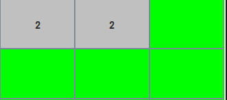

# Minesweeper

[](https://coveralls.io/github/eFabi11/Minesweeper?branch=main)


## Branches:

You can Play on the Main branch but the SE-12-FIleIO-2 has the posiility to use a Dockerimage

## Execute the Program

Run the game local: 

```
sbt run
```

Run the program in Docker: <br />
First switch to the Branch SE-12-FIleIO-2 <br />
Start an x11 server in the Background: Parameters: Multiple Windows, Display Number default -1, start no client, Disable accses control true
build the docker image with:

```
docker build -t minesweeper . --no-cache
```
start the Docker:

```
docker run -it --rm minesweeper
```

Execute the Program with

```
run
```
## Play the Game without docker:

```
sbt run
```

## Test

### Test commands

```
sbt clean coverage test
```

```
sbt coverageReport
```

## Rules
Minesweeper is a game where you clear a grid of hidden mines by using numerical clues to find all the safe squares. Here's how to play:

Objective: Open all safe squares without detonating any mines.

Starting the Game:

First choose a difficulty, the difault grid doesn´t work and give you an error.
The first click is always safe and will never get a mine.
Click randomly until you uncover a large area with several numbers.
Gameplay:

Opening Squares: Use the left mouse button to open squares.
Flagging Mines: Use the right mouse button to place a flag on suspected mines.
Number Clues: Safe squares have numbers indicating how many mines are adjacent to them.
Empty Squares: If an opened square does not touch any mines, it will be empty, and adjacent squares will automatically open until numbers are reached.

Difficulty Levels:

Easy: 3x3 grid with 1 mines.
Intermediate: 9x9 grid with 6 mines.
Expert: 16x16 grid with 40 mines.
Winning and Losing:

Winning: Open all safe squares.
Losing: Click on a mine.


## Hints:

After opening the first Field  it should look like this:


After selecting an other free Field:


Here you can see that in this area it should be 1 Bomb: <br />


In this Area it indicates there are 2 Bombs: <br />
</br>

## Authors

Fabian Eitel <br />
@eFabi11

